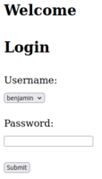
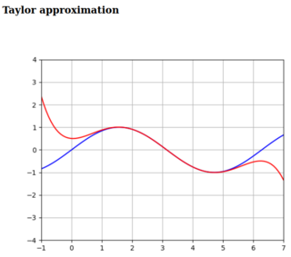
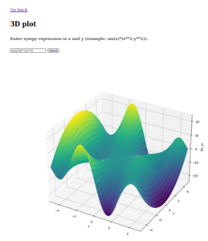
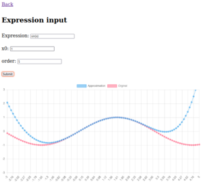

## Flask presentation for web engineering 2

This is a small project using Python Flask and demonstrating following features:

- Routing
- GET/POST requests
- Login/Logout with sessions (Hashing + random salt)
- Plotting 3D Plots
- Creating taylor series of any functions
- REST example with Chart.js and taylor creation

## Example pictures








## How to install

Following Python packages are needed:

- python3-flask
- python3-numpy
- python3-matplotlib
- python3-sympy


Change inside this folder and start
```
python3 appfile.py
```

Webapp will be hosted at http://127.0.0.1:8080. Password for user `benjamin` and `jakob` is `123`.
